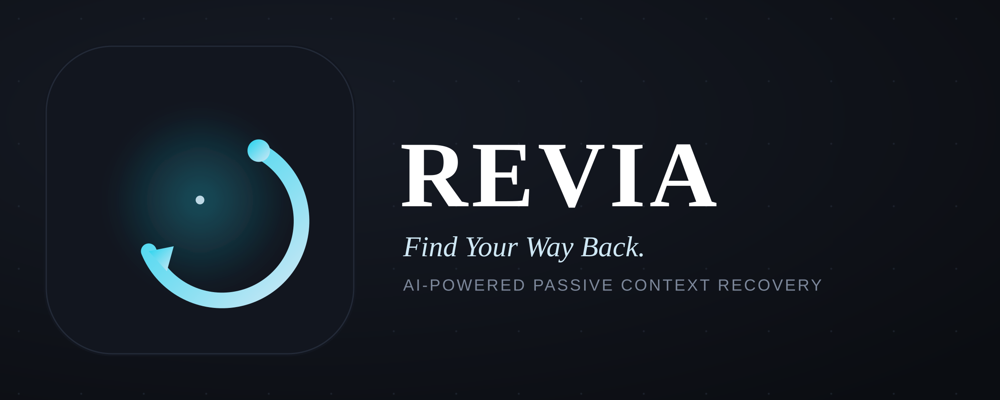
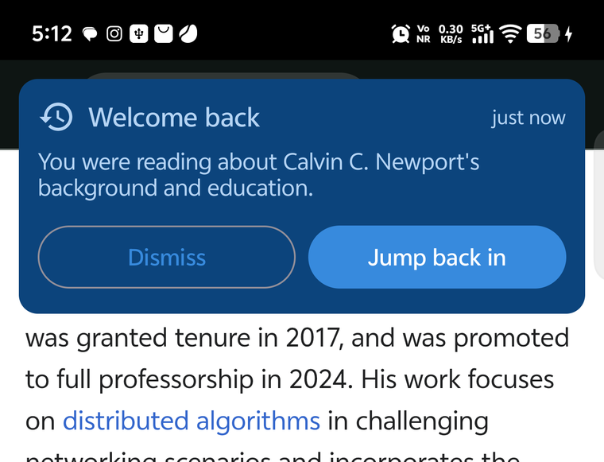

# Revia

**Passive context recovery for Android.** The moment something pulls you away, Revia notices
and tells you what you were doing — in a sentence, generated on the phone itself — so you can
jump straight back to it.

No screen recording. No server. No account. Nothing leaves the device.

---

## What it does

You're reading an article. A message arrives and you switch to reply. The instant you leave,
a card appears over whatever you switched to:



That sentence is real output from an iQOO 13 — written by Gemini Nano running on the phone's
NPU, from text Revia read off the screen before you left. Not "You were in Chrome". Not a
screenshot to squint at.

Tap **Jump back in** and it relaunches the article, not the app the card is floating over.
Ignore it and it disappears on its own.

If you keep wandering — reply, then get pulled into Instagram, then WhatsApp — that doesn't
raise three cards. The article stays the thing you were doing; the detour grows a trail on
the same card, and however you eventually get back to it, the card and the trail both go
away. Dismiss it while still adrift and it comes back after five minutes, because a
dismissed card isn't a resolved one.

## Why not just record the screen

Recall and Rewind answer this problem by screenshotting everything you do, continuously —
every message, every banking app, every private thing on your screen — and searching it later.
That is a large privacy cost for a small convenience, and it needs a machine powerful enough
to store and index it all.

Revia takes the opposite approach. It reads three lightweight signals that Android already
exposes, keeps them on the device, and throws them away once they've been used:

| Signal | Source | Used for |
|---|---|---|
| Which app is in front | `UsageStatsManager` | Noticing the interruption and the return |
| Text on screen | Accessibility service | Knowing *what* you were doing |
| Last notification | `NotificationListenerService` | Knowing what pulled you away |

## Choosing what Revia watches

Nothing is read until you say so. Onboarding ends with a picker, not a blanket grant — Revia
starts with an empty set and reads exactly the apps you switch on, nowhere else. It's also
what keeps the service cheap: an unpicked app is rejected on a set lookup before its screen
is ever walked, so battery cost scales with the handful of apps you actually chose, not with
everything installed.

Payment and banking apps sit outside that choice entirely, and not on trust alone — two tiers:

- **Android says the app settles UPI payments.** Checked by asking the system which apps can
  resolve a `upi://pay` intent, which catches ones we've never heard of. This is a hard
  block. It cannot be switched on, whatever the user wants.
- **The name reads as financial** — `phonepe`, `paytm`, `bank`, and similar, matched against
  the package and label. This is a guess, and guesses are wrong: `in.krosbits.musicolet`, a
  music player, matched `sbi` before the check was anchored to word boundaries instead of
  raw substrings. Apps caught this way are flagged, not blocked — the user can override one
  they know is safe.

## How it works

```
leave a watched app  ─▶  capture its screen text  ─▶  card shown immediately,
                                                       over wherever you landed
                                                              │
              ┌───────────────────────────────────────────────┘
              ▼
   still adrift, switch again  ─▶  named on the trail, not read, card unchanged
              │
   back at the original app  ─▶  card and trail withdrawn
```

The trigger is leaving, not returning — the old design waited for you to come back, which is
the one moment you no longer need reminding. Capture is deliberately cheap, since it has to
finish before the card can show. The real sentence is written once the card is on screen.

Summaries fall back in two tiers, so the app degrades instead of breaking:

1. **Gemini Nano**, on-device — private, free, works offline
2. **A template** — `You were in Notes — [captured text]`

There is deliberately no third, server-backed tier. Revia ships no networking code of its
own — nothing it captures has anywhere to go.

## On-device AI

Summaries run through [ML Kit's GenAI Prompt API](https://developers.google.com/ml-kit/genai/prompt/android/get-started),
backed by Gemini Nano in Android's AICore. Verified working on an **iQOO 13** (Snapdragon 8
Elite, `AICORE_QC_SM8750`), Android 16.

Two findings worth knowing if you build on this:

- **AICore refuses inference for a background process** (`GenAiException ErrorCode 30`).
  Capture happens in a foreground *service*, which is not enough. This is why the card is a
  transparent Activity rather than a window overlay — an Activity is genuinely foreground, so
  the summary can be generated while the card is on screen. A `TYPE_APPLICATION_OVERLAY`
  window does **not** lift the process out of "background".
- **The summarization API is the wrong tool** for this. It wants 400+ characters of prose and
  emits bullet points; our input is a handful of UI labels and we want one sentence. The
  Prompt API takes free-form instructions and fits.

Whether Nano is available is reported in **Settings → On-device AI**, along with the outcome
of recent attempts.

## Build and run

```bash
git clone https://github.com/codewithpraw/Revia.git
cd Revia
./gradlew :app:assembleDebug
```

Or open the folder in Android Studio and run. `local.properties` is generated on first open.

| | |
|---|---|
| Language | Kotlin 2.1.0, Jetpack Compose |
| Min / target SDK | 29 (Android 10) / 34 |
| Build | AGP 8.5.0, KSP 2.1.0-1.0.29 |
| Storage | Room 2.6.1, DataStore |
| On-device AI | ML Kit GenAI Prompt 1.0.0-beta2 |

On first run, open **Settings → On-device AI** and tap **Download on-device model** if it
reports `downloadable`. The download takes a few minutes and is not instant.

## Permissions

All four are granted manually in system settings; none are runtime dialogs.

| Permission | Why | Required? |
|---|---|---|
| Usage access | Detect app switches | **Yes** — nothing works without it |
| Accessibility | Read on-screen text | No, but summaries are vague without it |
| Notification access | Read the interrupting notification | No |
| Draw over other apps | Show the card over the app you're in | No — card still appears inside Revia |

Usage access and picking at least one app both block onboarding; everything else is
optional. The system can revoke accessibility at any time — vivo and OPPO do this
routinely under power management — and losing it degrades summaries to the template
rather than stopping detection. The watched-apps list is loaded independently of
accessibility for the same reason: it used to live only there, so losing accessibility
silently meant capturing nothing while the app still claimed to be watching.

## Privacy

- **Nothing is watched by default.** Capture only happens for apps explicitly switched on;
  see [Choosing what Revia watches](#choosing-what-revia-watches).
- **Payment and banking apps are walled off before the screen is ever read**, not filtered
  after. The check runs as the first line in the accessibility event handler.
- **Password fields are never captured** — nodes flagged `isPassword` are skipped.
- **Captured text is consumed when read**, so it can't describe a later, unrelated interruption.
- **Apps passed through during a detour are named, not read.** Hopping Instagram → WhatsApp
  while adrift from an article puts both names on the card's trail; neither app's screen is
  ever walked.
- Data lives in the app's private database. Clear it any time from Settings.
- **Screen content never leaves the phone.** Revia has no networking code and no server to
  talk to; captured text goes to the on-device model or nowhere. Verified directly, not just
  by design: a summary was generated with the phone's radio fully disabled.
- **The app does hold `INTERNET`, and it is worth being precise about why.** It is not
  declared in Revia's manifest — it arrives through `com.google.mlkit:genai-prompt`, which
  depends on Google's `transport-backend-cct`. ML Kit needs network access to download the
  Gemini Nano model, and that library carries Google's own telemetry. That is a Google
  dependency doing Google things, not a path for anything Revia captures.

This is a hackathon prototype, and honest about it: the local database is not encrypted,
`allowBackup` is still on, and there is no retention limit. Those are the things to fix
before anyone real uses it.

## Project structure

```
app/src/main/kotlin/com/revia/
├── service/      detection (UsageStats), accessibility capture, notifications
├── data/
│   ├── db/       Room entity, DAO, database
│   ├── summary/  Gemini Nano via ML Kit Prompt API
│   ├── repository/
│   └── ServiceLocator.kt   connects the detection service to the UI
├── ui/
│   ├── screen/   onboarding, home, history, settings, app picker
│   ├── overlay/  the card shown over other apps
│   └── theme/
├── util/
│   └── AppFilter.kt   the opt-in set and the payment/banking wall
└── viewmodel/
```

## Known limitations

- **Summary quality follows what's on screen.** A Wikipedia article reads well; a camera
  viewfinder has almost nothing to work with, and the summary stays thin.
- **Devices without AICore fall back** to the template summary. Gemini Nano is not on every
  phone, and there is no server-side path by design.
- **A detour never expires on its own.** It only ends by returning to the app you left, so an
  abandoned one can go on absorbing hops for hours, mislabeling whatever you're actually
  doing later as a detour from something you gave up on long ago. No dwell-based cutoff yet.
- **The captured notification isn't used by the summarizer.** It's stored as a fallback when
  there's no on-screen text, but the model's prompt has a separate slot for "what
  interrupted you" that nothing currently fills — wiring it through needs a schema change,
  not just a code change.
- **vivo and OPPO suppress third-party logcat output**, which is why diagnostics surface in
  Settings rather than the log.
- History filters and swipe-to-delete from the original spec are not built.
- There are no automated tests.

## Hardening notes

Two failures only showed up under real OEM behavior, not in a normal test run, so they're
worth naming rather than burying in a commit log:

- **The detection service losing accessibility used to mean capturing nothing while the app
  still claimed to be watching** — the watched-apps list had exactly one loader, and it lived
  in the accessibility service. It now loads independently, so losing accessibility degrades
  summaries instead of going silent.
- **Dismissing a card used to cancel its own summary.** Inference ran inside the card's
  composition, so closing the card — or the auto-dismiss timer beating it — threw the
  in-flight result away and left the template standing for good. It now runs on a scope that
  outlives the card; dismissing only stops watching for the result, not the work itself.

## Status

Built for the iQOO Hackathon Battle Ground Hyderabad, productivity track. The full loop —
detect, capture, summarize on-device, display over the app — works end to end on real
hardware, verified on both an iQOO 13 (Gemini Nano available) and a device without AICore
(template fallback confirmed).
